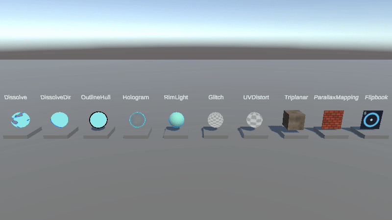
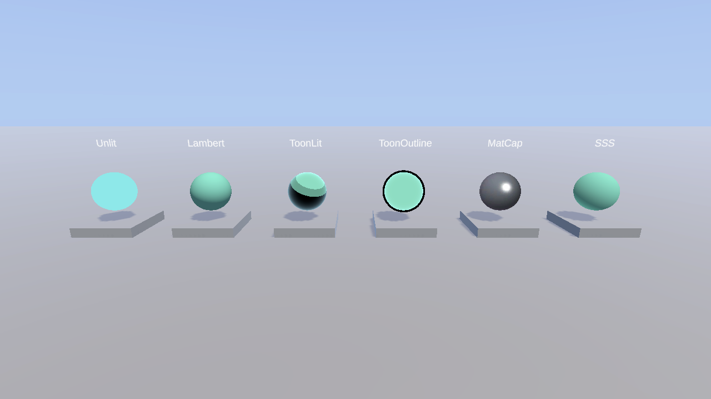
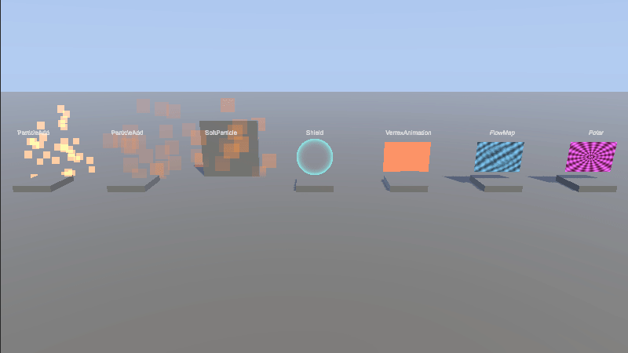
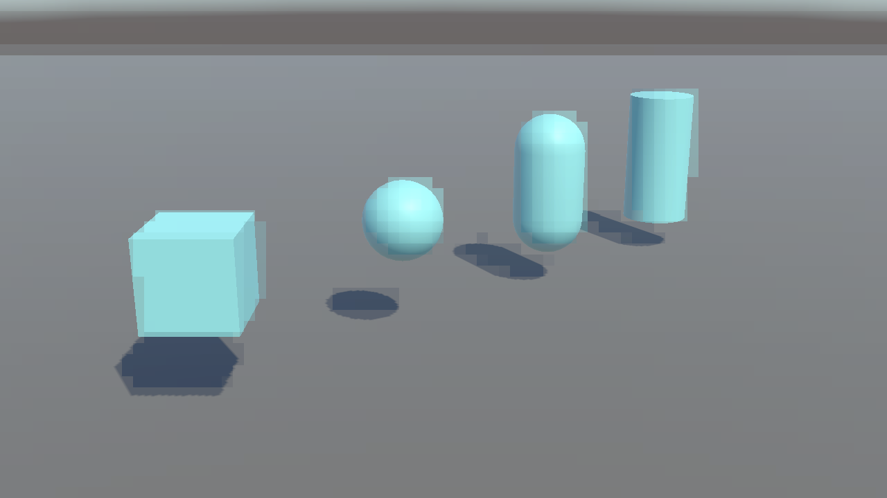

# RenderLib

面向 Unity URP 的手写 HLSL 常用效果封装，供业务项目快速复用。

Reusable hand-written HLSL shaders for Unity URP.

Unity 2022.3 LTS · URP 14 · MIT · Work in progress

RenderLib is a small kit of common URP effects you can drop onto a production scene: assign a shader on a Material, or add a Renderer Feature and drive it from a Volume.

Every effect is hand-written HLSL (no Shader Graph) on Unity 2022.3 LTS and URP 14. Shared helpers live in `_Core`; each effect ships as a shader plus a demo material.

The set is still growing. Upcoming rows in the table below are not shipped yet.

## Reuse

- Object effects: on a Material, set Shader to the matching `RenderLib/...` path (for example `RenderLib/Shading/ToonLit`).
- Post effects: add the matching Renderer Feature on `Assets/Settings/URP-RenderLib_Renderer.asset` and control it with a Volume (`RenderLib/Pixelation`, `RenderLib/OutlinePost`, `RenderLib/Vignette`, `RenderLib/Underwater`).
- Open `Assets/Scenes/Gallery.unity` or a `Demo_*` scene to see the packaged examples.

## Previews

### Demo_Shading

### Demo_VFX

### Demo_PostProcess

## Effects

| Name | 名称 | Category | Status |
| --- | --- | --- | --- |
| Unlit | 无光照 | Shading | Done |
| Lambert | Lambert 漫反射 | Shading | Done |
| ToonLit | 卡通光照 | Shading | Done |
| ToonOutline | 卡通描边 | Shading | Done |
| MatCap | MatCap | Shading | Done |
| SSS | 次表面散射 | Shading | Done |
| Dissolve | 溶解 | Stylized | Done |
| DissolveDir | 方向溶解 | Stylized | Done |
| OutlineHull | 反转外壳描边 | Stylized | Done |
| Hologram | 全息 | Stylized | Done |
| RimLight | 边缘光 | Stylized | Done |
| Glitch | 故障 | Stylized | Done |
| UVDistort | UV 扭曲 | Stylized | Done |
| Triplanar | 三平面投影 | Stylized | Done |
| Parallax | 视差 | Stylized | Done |
| Flipbook | 序列帧 | Stylized | Done |
| ParticleAdd | 叠加粒子 | VFX | Done |
| ParticleAlpha | 透明粒子 | VFX | Done |
| SoftParticle | 软粒子 | VFX | Done |
| Shield | 能量护盾 | VFX | Done |
| VertexAnim | 顶点动画 | VFX | Done |
| FlowMap | FlowMap | VFX | Done |
| Polar | 极坐标 UV | VFX | Done |
| ProceduralSky | 程序化天空 | Environment | Done |
| Water | 水面 | Environment | Done |
| Underwater | 水下 | Environment | Done |
| TerrainBlend | 地形混合 | Environment | Done |
| Grass | 草 | Environment | Upcoming |
| Snow | 雪 | Environment | Upcoming |
| Pixelation | 像素化 | PostProcess | Done |
| OutlinePost | 后处理描边 | PostProcess | Done |
| Vignette | 暗角 | PostProcess | Done |
| ColorGrade | 调色 | PostProcess | Upcoming |
| Chromatic | 色差 | PostProcess | Upcoming |
| FilmGrain | 胶片颗粒 | PostProcess | Upcoming |
| UIRounded | 圆角 UI | UI | Upcoming |
| UIGradient | UI 渐变 | UI | Upcoming |

## Open the project

1. Clone `https://github.com/sophia-y-labs/RenderLib.git`
2. Open the folder in Unity **2022.3 LTS** (URP 14).
3. Play `Assets/Scenes/Gallery.unity`.
4. Category demos: `Demo_Shading`, `Demo_Stylized`, `Demo_VFX`, `Demo_Environment`, `Demo_PostProcess` (all under `Assets/Scenes/`).

## Layout

`Assets/_Core` holds shared HLSL. `Assets/Shaders` groups effects by category. `Assets/Scenes` contains Gallery plus one demo scene per shipped category.

## License

MIT. See [LICENSE](LICENSE).
